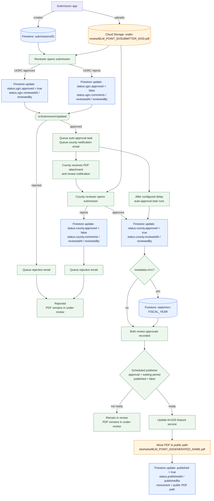

# PLSS Monument Review

A website to view and approve to monument record sheet submissions

[Prod URL](https://plss-review.ugrc.utah.gov/)

[Dev URL](https://plss-review.dev.utah.gov/)

## Submission flow

The submission app creates the Firestore document and uploads the original PDF. This review app reads the document and PDF, records review decisions, and publishes approved submissions. The diagram shows the changes made to Firestore and Cloud Storage by each step.

## Development

1. Install dependencies
   - `pnpm install`
   - `pnpm copy:arcgis`
1. Duplicate `.env` as `.env.local` with local secrets.
1. Install functions dependencies
   - `cd functions`
   - `pnpm install`
1. Duplicate `functions/.secrets` as `.secrets.local` with local secrets.
1. Start the website
   - `pnpm start`
   - Windows: `pnpm start-win`
     - **Note:** If restarting pnpm, be sure to close the `cmd` windows that it opens first.
1. Log in via Firebase in order to access the `Staff Reviewer` user
   - `pnpx firebase-tools login --reauth`
   - Select A and Yes, hit Enter, and click Allow on the browser popup
1. Browse to the [development server](http://localhost:5173/) and login as `Staff Reviewer`

## Deployment

1. Create a site in firebase hosting
1. Enable multi tenancy in the Google Identity platform
1. Add credential created in apadmin to the tenant
1. Update the authentication blocking functions after deployment
1. Allow the storage rules to query the database in the firebase console

GitHub Actions installs dependencies for the standalone `functions/` package before Firebase deploys, and `firebase.json` continues to use `functions` as the deploy source for both local development and CI.

## User Management

To add new users:

1. Ask the user to register on plss.utah.gov (or plss.dev.utah.gov in dev)
1. Find the user's record in the submitters collection in firebase and update the elevated field to be true.

## :robot: Dependabot

### Tailwind

The following dependencies need to stay at the tailwind v3 versions

| Package                           | Tailwind 3 | Tailwind 4 |
| --------------------------------- | ---------- | ---------- |
| tailwind-merge                    | v2         | v3         |
| tailwindcss                       | v3         | v4         |
| tailwindcss-react-aria-components | v1         | v2         |

## Attribution

This project was developed with the assistance of [GitHub Copilot](https://github.com/features/copilot).
